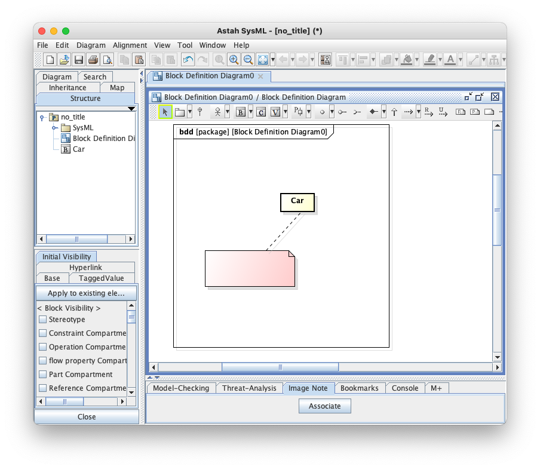
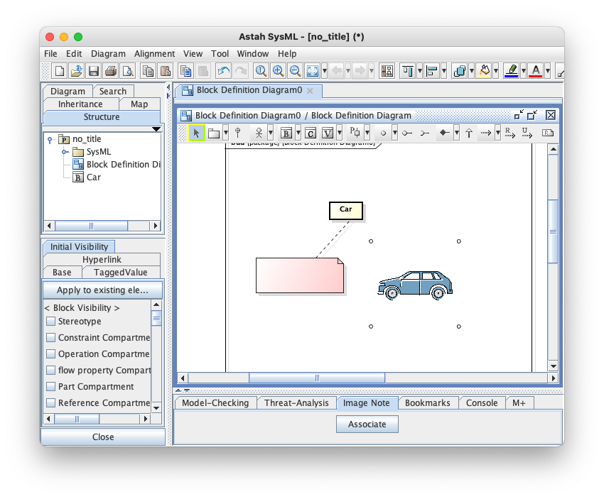
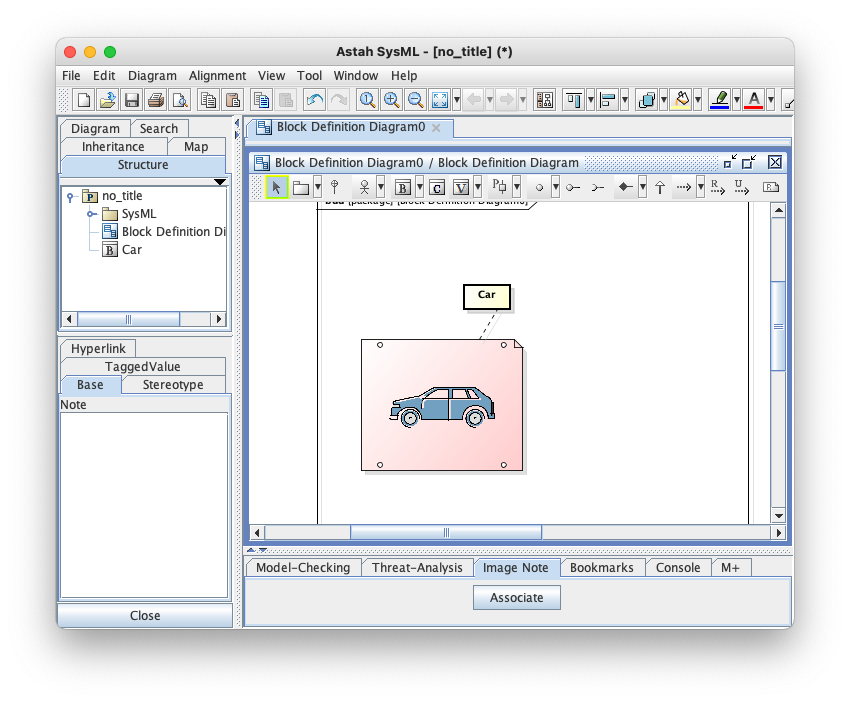

Astah Image Note Plugin
===============================

Version
----------------
1.0

Available for
----------------
astah* professional, UML, SysML

Description
----------------
This is a plugin to support notes with images.  More precisely, a note can be associated with an image and then the position and the size of a note can automatically be aligned according to the associated image and vice versa.

How to install
----------------

0. Download .jar file from
   https://github.com/ChangeVision/astah-image-note/releases/tag/v1.0
1. Launch Astah and drag the downloaded .jar file to an open instance of Astah. A pop-up will appear asking you to confirm installation, choose [Yes].
2. If the pop-up opens, restart Astah and open any project.
3. Now you will have [Image Note] Tab in the Extension View below the Diagram Editor.

How to use
----------------
### Associating a note with an image
First assume you prepare a note that you want to use it with an image.

Here, you can drag and drop an image as follows.

Then, move the image onto the note.

Remark that a note is required to cover the image completely. With this status, push "Associate" button in the Image Note tab.

You will see that the color of the note is changed, indicating that the note is associated with an image.  Push "Refresh based on Image".

You can recognize that the size of the note is adjusted according to the associated image.  Next, try to move a note.

At this point, push "Refresh based on Note" button.
You can see that the image has been moved according to the position of the note.

Of course, you can use this plugin with several notes.

License
---------------
Copyright 2021 Change Vision, Inc.

Licensed under the Apache License, Version 2.0 (the "License");
you may not use this work except in compliance with the License.
You may obtain a copy of the License in the LICENSE file, or at:

<http://www.apache.org/licenses/LICENSE-2.0>

Unless required by applicable law or agreed to in writing, software
distributed under the License is distributed on an "AS IS" BASIS,
WITHOUT WARRANTIES OR CONDITIONS OF ANY KIND, either express or implied.
See the License for the specific language governing permissions and
limitations under the License.
