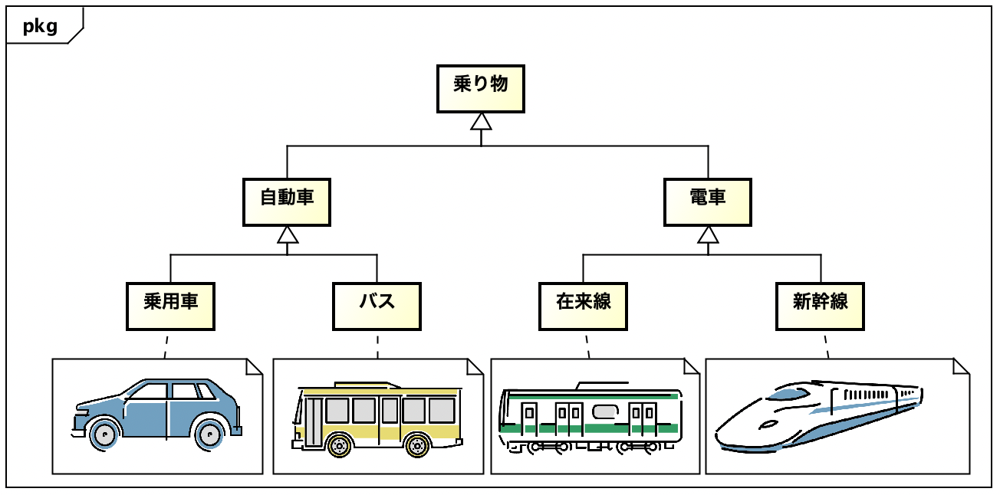

astah* Image Note プラグイン
===============================

Version
----------------
1.2

Available for
----------------
astah* professional, UML, SysML

Description
----------------
画像を用いたノートを使いやすくするプラグインです。具体的には，ノートと画像が紐付けられることにより，位置合わせやサイズ合わせを自動的にしてくれます。

How to install
----------------

0. 以下から .jarファイルをダウンロードしてください。
   https://github.com/ChangeVision/astah-image-note-plugin/releases/download/v1.1/astah-image-note-1.1.jar
1. 上部メニュー[ヘルプ] – [プラグイン一覧] からプラグイン一覧を開きます。
2. [インストール] ボタンをクリックし、jarファイルを選択してインストールしてください。
3. astah* を再起動し、プロジェクトを開きます。
4. 下部の拡張ビューに[Image Note]タブが追加されます。

使い方
----------------
### ノートとの関連付け
- はじめに，画像を使いたいノートを次のように準備したとします。
  - 
- ここで，ノートに使いたい画像を次のようにドラッグアンドドロップしたとします。
  - 
- つぎに，ノートの上に画像を移動します。
  - 
- ノートが完全に画像を含むように大きさを調整してください。この状態で，Image NoteタブにあるAssociateボタンを押します。
  - 
- 色が変わってノートと画像が紐付けられたことが分かります。この状態で，画像を移動してみましょう。
  - 

ノートがたくさんに増えても大丈夫です。

License
---------------
Copyright 2021 Change Vision, Inc.

Licensed under the Apache License, Version 2.0 (the "License");
you may not use this work except in compliance with the License.
You may obtain a copy of the License in the LICENSE file, or at:

<http://www.apache.org/licenses/LICENSE-2.0>

Unless required by applicable law or agreed to in writing, software
distributed under the License is distributed on an "AS IS" BASIS,
WITHOUT WARRANTIES OR CONDITIONS OF ANY KIND, either express or implied.
See the License for the specific language governing permissions and
limitations under the License.
